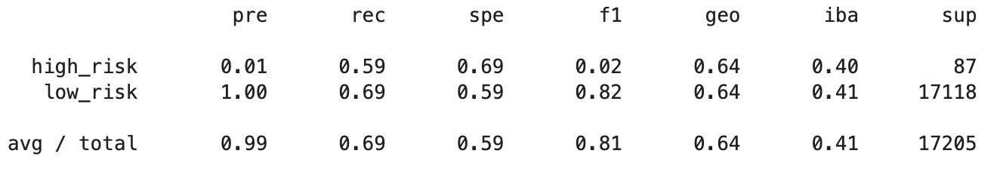
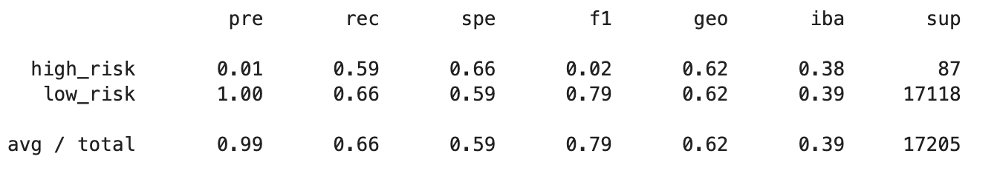
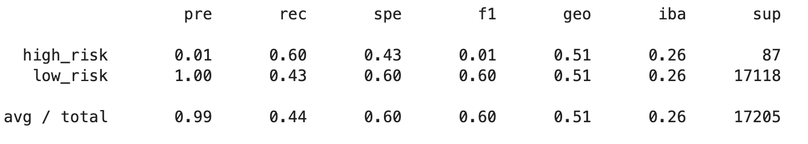
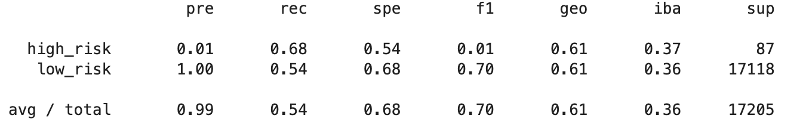
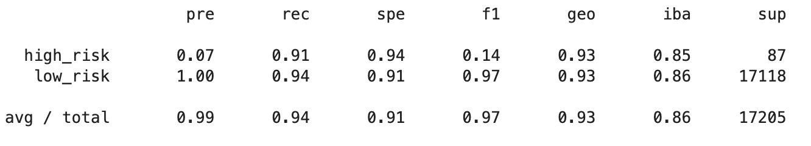

# Credit Risk Analysis

## Overview
LendingClub is a peer-to-peer lending services company hoping to use supervised machine learning techniques to quantify factors involved in credit risk and lending. Low-risk applicants far outweigh high-risk applicants, thus leading to a severe imbalance in the training and testing data. By trying a variety of machine learning algorithms we can make best use of the imbalanced data. The most typical techniques to mitigate this involve over-sampling the minority class, under-sampling the majority class, a combination of under and over-sampling, and ensemble methods.
## Results 

#### **Oversampling**
* Random Over Sampler: over-samples the minority class by picking samples at random with replacement. With a 64% accuracy score, extremely poor precision for high-risk applicants, and poor recall for both classes - this algorithm is a bad choice for this data and task.

* SMOTE: Synthetic Minority Over-sampling Technique addresses the imbalance by synthesizing new examples from the minority class. With a 62% accuracy score, extremely low precision for the minority class, and slightly worse recall - SMOTE is an even worse choice than random over sampling for this data and task.

#### **Undersampling**
* Cluster Centroids: undersamples the majority by using the KMeans algorithm to cluster the majority class and generating a new dataset with the coordinates of cluster centroids. With a 51% accuracy score, and slightly worse recall of the low-risk class - undersampling might not be an effective technique for our purposes.

#### **Combination Sampling**
* SMOTEENN: a combination of SMOTE and an undersampling technique, Edited Nearest Neighbor(ENN), SMOTEENN balances a dataset by generating synthetic data for the minority class and omits peripheral instances of the majority class. This model had a 61% accuracy score, and showed no improvement in precision or recall, so is not effective in this case.

#### **Ensemble Learners**
* Balanced Random Forest Classifier: under-samples bootstrap samples at random to balance a dataset. With a 78% accuracy score, better precision, and greatly improved recall - this model is better suited to this task than any of the above methods.

* Easy Ensemble Classifier: balances data by drawing only a subset of the majority class and utilizes incorrectly classified instances to refine the model. With a 93% accuracy score, and a marked improvement in recall and precision - this model outperforms all methods above. 

## Summary
Out of the six machine learning algorithms trialed above, the Easy Ensemble Classifier had the highest accuracy score and the best precision and recall for the minority class, so it is the most successful at predicting credit risk.